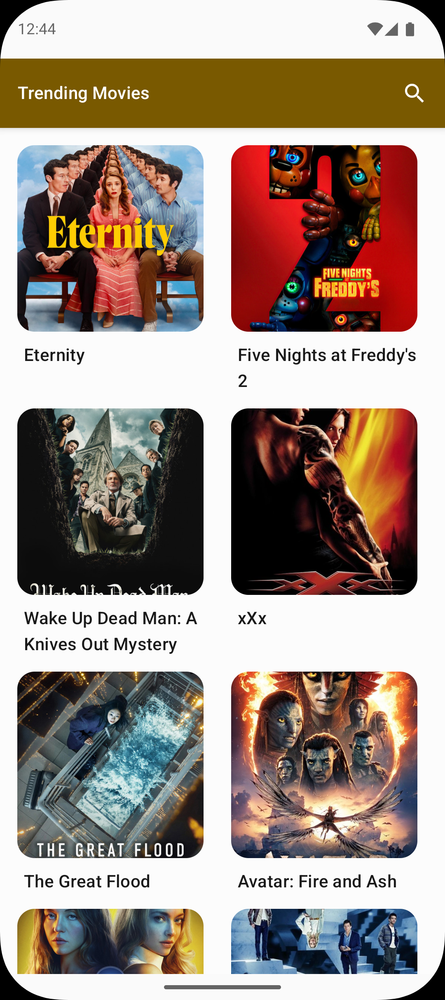
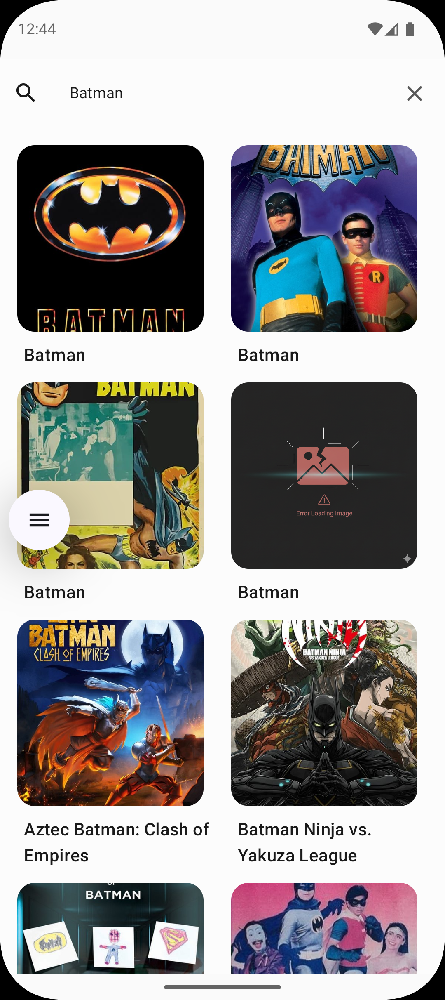
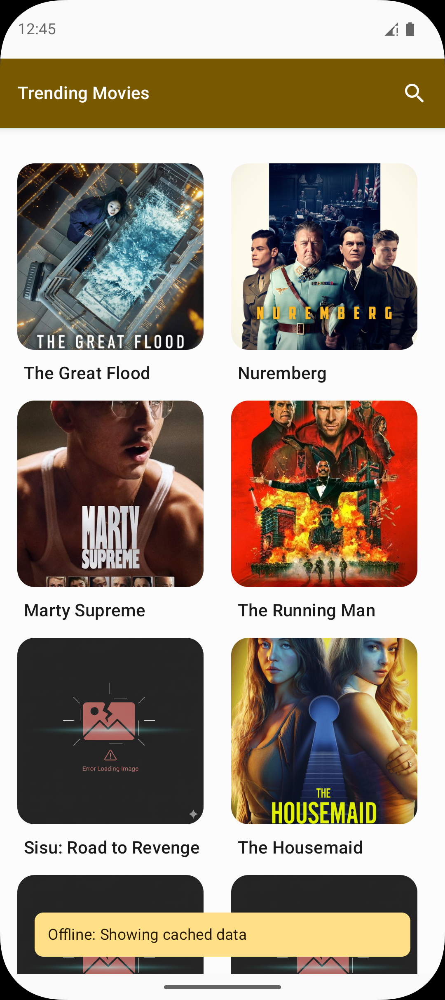
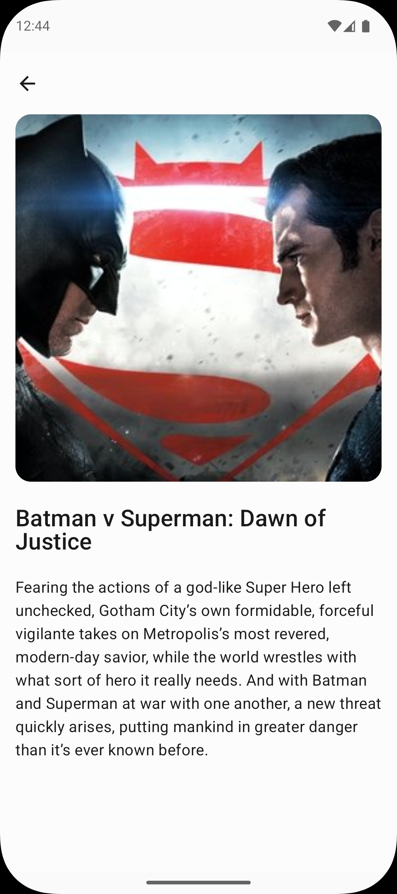
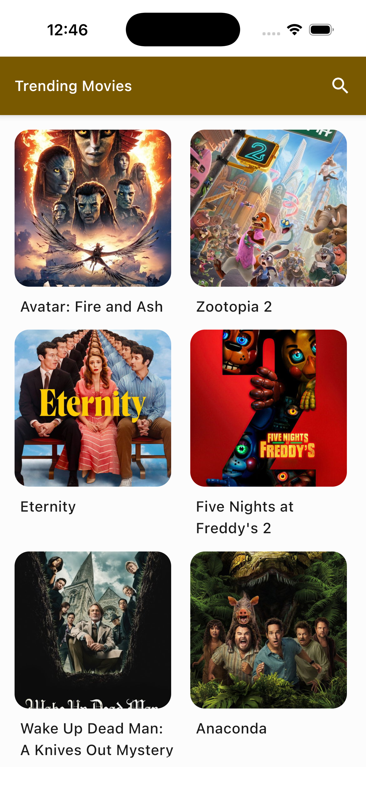
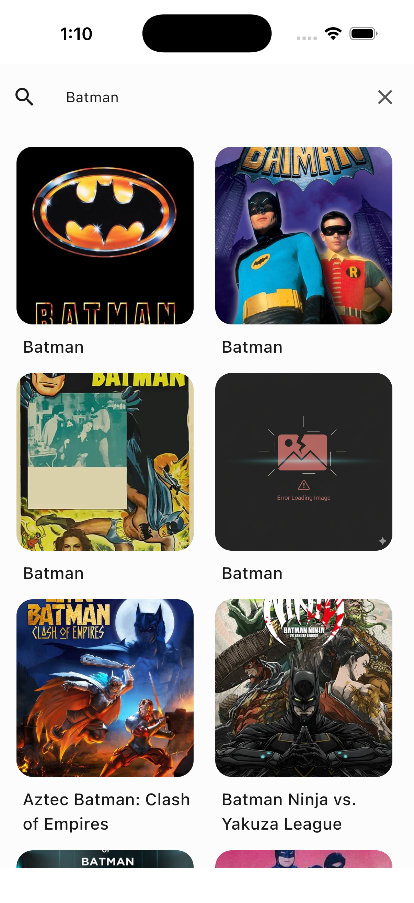
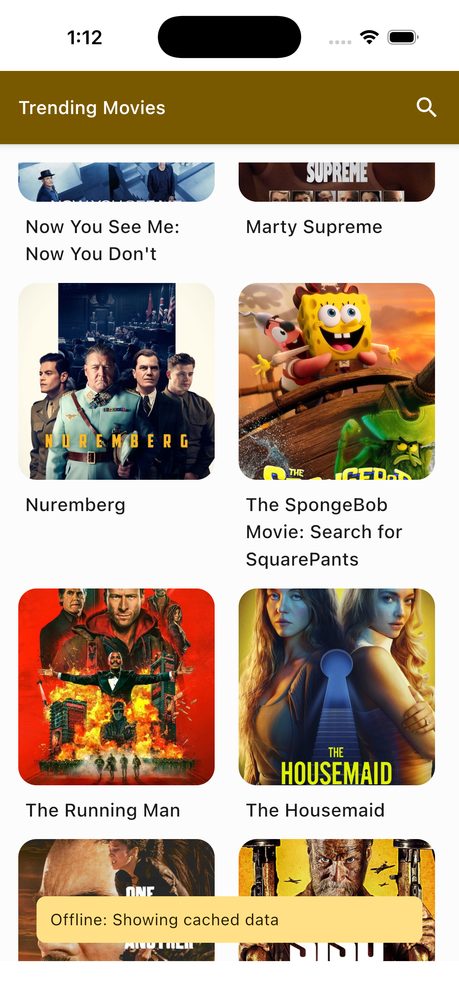
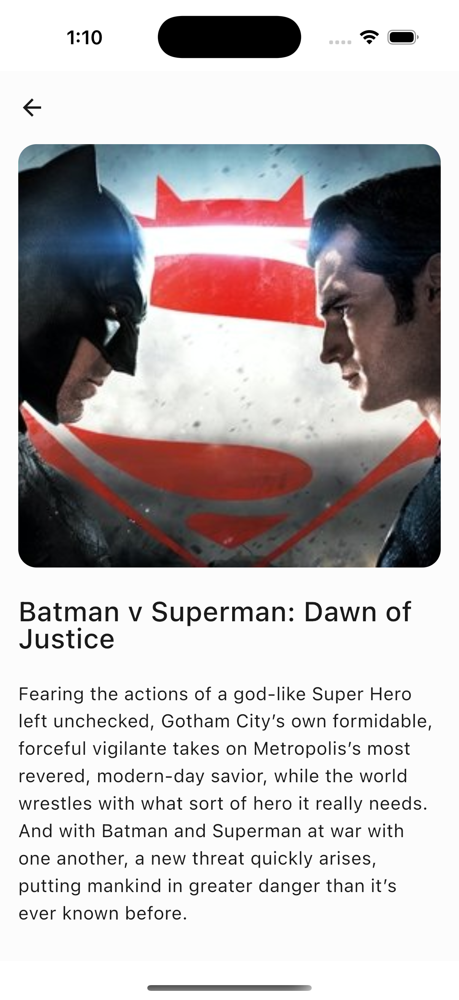

# 🎬 Movie Directory - MovieDB KMP App

A Kotlin Multiplatform (KMP) application demonstrating a unified codebase for Android and iOS using
**Compose Multiplatform**. This project fetches data from The Movie Database (TMDB) API to display
trending movies with detailed information, robust offline support, and modern architecture.

Built as part of the **Kotlin Multiplatform Assignment**.

## 🚀 Overview

This application implements a **Two-Screen Flow** (List & Details) completely in Kotlin. It
leverages a shared core for business logic and UI, ensuring feature parity across platforms while
maintaining platform-specific optimizations where necessary.

### Key Goals Achieved

* **Shared UI:** 100% code sharing for UI using Compose Multiplatform.
* **Offline First:** Caches successful responses to support full functionality without an internet
  connection.
* **Modern Stack:** Utilizes Coroutines, Flow, Ktor, and SQLDelight.

## 🛠 Tech Stack

* **Language:** Kotlin (100%)
* **Platform:** Kotlin Multiplatform (Android & iOS)
* **UI Framework:** Compose Multiplatform
* **Architecture:** MVVM / MVI (Model-View-Intent)
* **Networking:** Ktor Client
* **Async & Concurrency:** Kotlin Coroutines & Flow
* **Dependency Injection:** Koin
* **Local Caching:** SQLDelight
* **Serialization:** kotlinx.serialization
* **Image Loading:** Coil (Compose Multiplatform)

## 📱 Features

### Core Requirements

* **Movie List:** Fetches a scrollable list of trending movies with a search capability.
* **Movie Details:** Displays detailed metadata (Overview, Release Date, Rating, Genres) for a
  selected movie.
* **Offline Mode:** If the network is unavailable, the app serves data from the local SQLDelight
  database with a visual indicator ("Showing cached results").
* **State Management:** Handles `Loading`, `Success`, and `Error` states gracefully.

### 🌟 Bonus Implementations

* **Infinite Scrolling / Pagination:** specific implementation to handle large datasets seamlessly.
* **Dependency Injection:** Full Koin setup for modular and testable code.

## 🏛 Architecture

The project follows the principles of Clean Architecture combined with MVVM/MVI.

1. **UI Layer (Shared):** Composable functions that observe UI State.
2. **Presentation Layer:** `ViewModel` holds the `StateFlow` and handles UI events (Intents).
3. **Domain Layer:** UseCases (optional) and Repository interfaces.
4. **Data Layer:**
    * **Remote:** Ktor Client for API calls.
    * **Local:** SQLDelight for caching as the "Single Source of Truth".

### Offline Strategy

The repository pattern manages data synchronization:

1. The app observes the database (SQLDelight).
2. When data is requested, the app attempts to fetch fresh data from the API.
3. **Success:** The API response is saved to the database; the UI updates automatically via the Flow
   observation.
4. **Failure:** The app catches the exception and emits the previously cached data from the database
   along with an error message/indicator.

## ⚙️ Setup & Configuration

### Prerequisites

* Android Studio (Ladybug or newer recommended)
* Xcode (for iOS runner)
* JDK 17+

### 🔑 API Key Configuration

This project uses **The Movie Database (TMDB)** API. You must provide your own API key to run the
app.

1. Obtain an API Key from [The Movie DB](https://www.themoviedb.org/documentation/api).
2. Open the `local.properties` file in the root directory.
3. Add the following line:

```properties
apiKey=your_actual_api_key_here
```

## 📸 Screenshots

| Platform |                                    Movie List Screen                                     |                                            Searching Movie                                             |                                             Offline Support                                              |                                         Movie Detail                                         |
|:--------:|:----------------------------------------------------------------------------------------:|:------------------------------------------------------------------------------------------------------:|:--------------------------------------------------------------------------------------------------------:|:--------------------------------------------------------------------------------------------:|
| Android  |  |  |  |  |
|   iOS    |      |      |      |      |